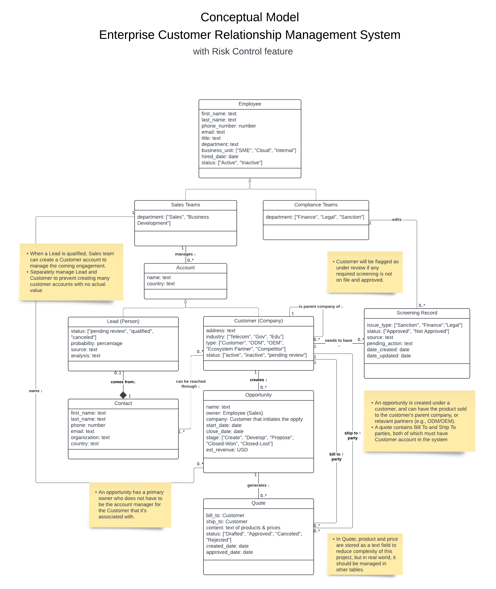
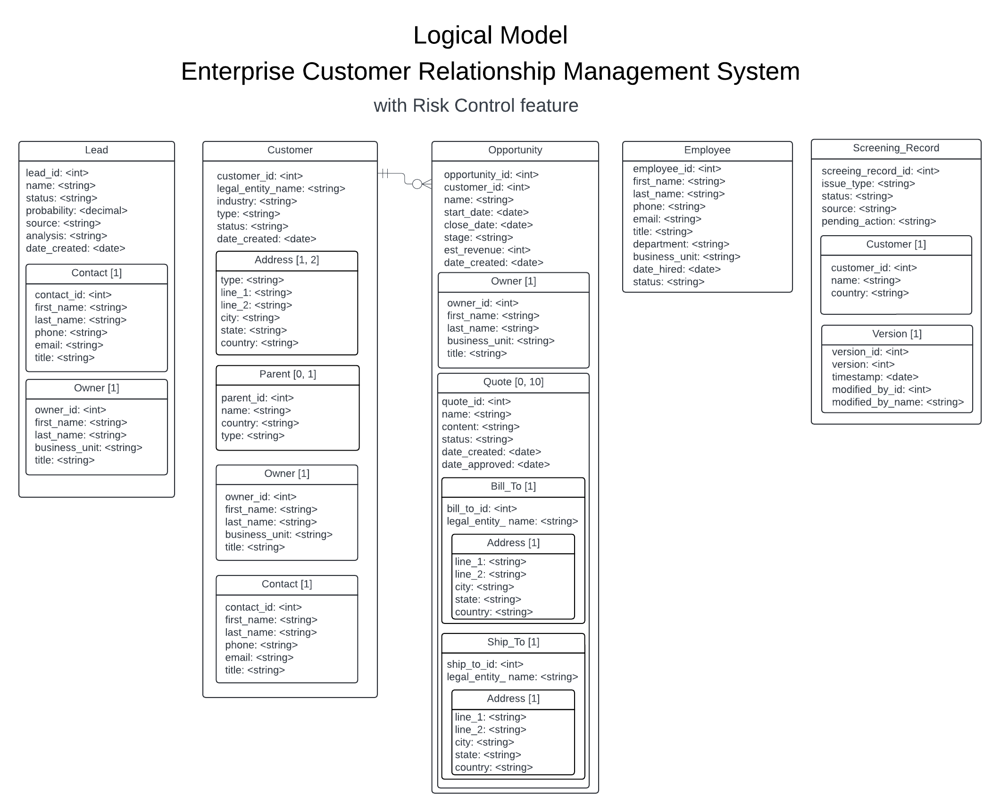

# Enhanced Customer Relationship Management System

This project creates a Customer Relationship Management (CRM) system for managing enterprise customers. In addtion, it incorporates risk control mechanism to ensure all parties of a transaction are screened for potential risks.

<!-- The system is built using Node.js and Express.js, and uses [database name] as the database. -->

## Conceptual Model

UML Class Diagram


## Logical Model

([link](https://lucid.app/lucidchart/2da1e4e2-e400-4acb-af34-0afa0a122638/edit?view_items=JWWowJgIFUbH&invitationId=inv_f5a92ee0-36d3-4dac-9cdf-52bdf0759fc8) to Lucidchart)


## Schema

Refers to example JSON objects of each collection in the [db/json_examples.js](db/json_examples.js) file. The comments describe some rules for the fields.

## Database Setup

This project uses MongoDB as the database. To use the database, install the required tools, clone this repository and run the following commands in the terminal:

1. Tools required:

   - [MongoDB](https://www.mongodb.com/try/download/community) for the database server. By default, MongoDB runs on `localhost:27017`. Below commands assume this configuration.
   - [MongoDB Database Tools](https://www.mongodb.com/try/download/database-tools) for importing and exporting data.
   - [MongoDB Compass](https://www.mongodb.com/try/download/compass) for viewing the data.

2. There are two ways to regenerate the sample database.

   1. Using mongorestore to load data from dump files.

      ```bash
      mongorestore db/dump/
      ```

   2. Using mongoimport to load data from each of the JSON files to a databases called `crm`. Change the file name to load different collections (Customer, Employee, Lead, Opportunity, Screening Record).

      ```bash
      mongoimport -d crm --jsonArray --file db/sample_data/[filename].json --jsonArray
      ```

3. To run the sample queries using node.js, use the following command. Change the query number to run different queries.

   ```bash
   node db/sample_queries/query1.js
   ```

<!-- ## Web Application

The web application implements the Employee and Customer tables. It is built using Node.js and Express.js. To run the web application, clone this repository, navigate to the webapp directory, and run the following commands in the terminal:

1. Install the required packages:

   ```bash
   npm install
   ```

2. Start the server:

   ```bash
   npm start
   ```

3. Go to http://localhost:3000 in your browser to view the web application. -->

---

_This project was developed as part of the course CS 5200 Database Management Systems taught by Professor John Alexis Guerra Gomez at Northeastern University (Oakland)._
